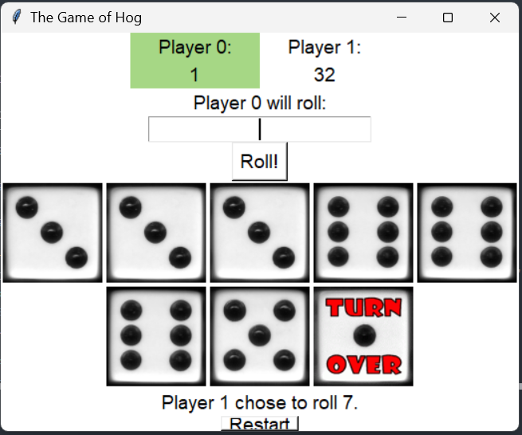

# Hog-Dice-Game
A simple turn-based dice game where players roll dice to accumulate points. The goal is to reach 100 points first. Players can choose to "hold" to bank their points or risk rolling again. The game includes basic rules, player turn management, and scoring logic. 



## 🚀 Features

- Turn-Based Gameplay: Players alternate turns, rolling dice to accumulate points.
- Hold Mechanism: Players can choose to "hold" to bank their points or continue rolling.
- Risk vs. Reward: Decide whether to risk rolling again or secure your points.
- Game Over Condition: The game ends when a player reaches 100 points.

## 🧪 Testing
Automated tests can be run using the provided autograder.py script.

```bash
python autograder.py
